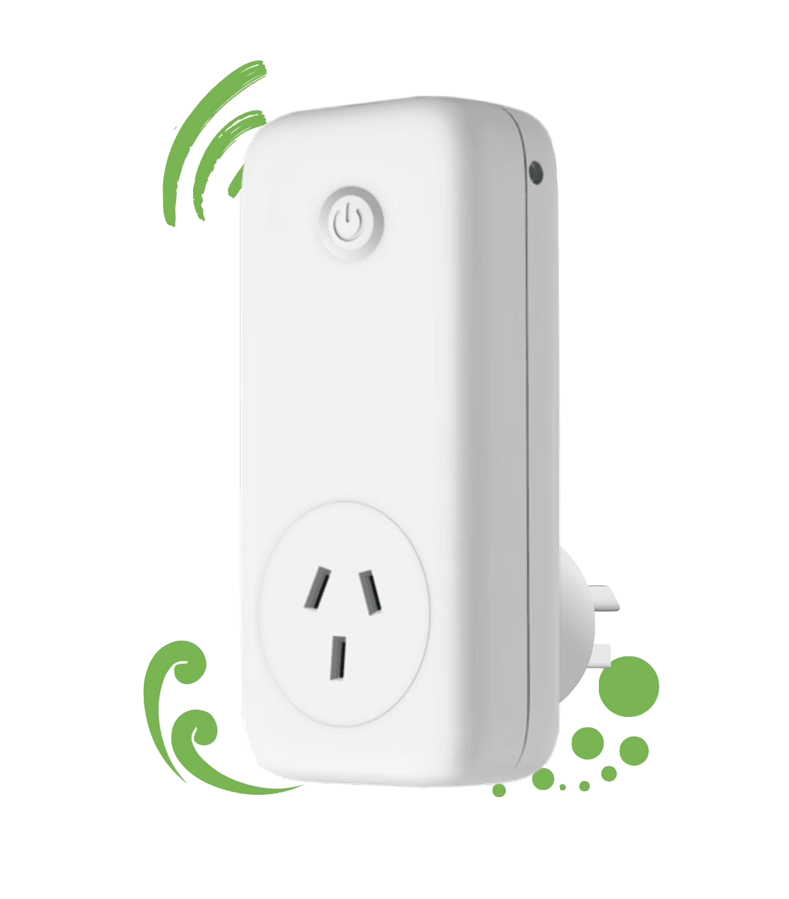

# Vaiotech KW 600 Rowi2

This project is the home of the [ESPHome][esphome] firmware for the [Vaiotech KW600][vaiotech].

> **Note:**
> If you intend to integrate your device with Home Assistant, please ensure you order the **ESPHome firmware** version of Rowi2. The default firmware does **not** support Home Assistant integration.

Rowi2 is available in two different versions:
- **Default Rowi firmware:** Local REST API & MQTT integration
- **ESPHome firmware:** For Home Assistant and custom automation

There are two external sensors available:
- Temperature and Humidity
- Temperature, Humidity, and Air Quality

Details and technical specs: [Rowi2 Specifications][vaiotech-tech]
Where to buy: [Kiwi Warmer Online Shop][vaiotech-shop]

---

## ESPHome Firmware Features

- Onboard device to Home Assistant using [Improv-BLE][onboarding]
- Temperature and humidity offset
- Option to calibrate voltage, current, power, and energy
- Factory reset device by pressing button for over 10 seconds
- **Automatic firmware updates:** The ESPHome factory firmware supports auto-update for new releases

---

## LED Status & Light Modes

The RGB LED on the Rowi2 device indicates the current state:

| State                                  | Color / Effect           | Description                                      |
|----------------------------------------|--------------------------|--------------------------------------------------|
| **Improv BLE (Onboarding)**            | Aqua, Fast Pulse         | Device is in onboarding mode                     |
| **Initialization (WiFi connected)**    | Solid White              | Device is initializing, WiFi connected           |
| **Initialization (WiFi not connected)**| Magenta, Slow Pulse      | Device is initializing, WiFi not connected       |
| **No Home Assistant Connection**       | Red, Asymmetrical Pulse  | Lost connection to Home Assistant                |
| **Relay ON**                           | Solid Orange             | Output relay is ON                               |
| **Relay OFF**                          | Solid Green              | Output relay is OFF                              |
| **Factory Reset Requested**            | Solid Blue, Fast Pulse   | Hold button >10s, factory reset pending          |
| **Overcurrent Detected**               | Solid Red, Fast Pulse    | Current exceeded configured limit, power cut     |

**Notes:**
- The LED updates automatically based on device state.
- Factory reset is triggered by holding the button for more than 10 seconds.

---

## Getting Started

- [Onboarding Guide (Improv-BLE)][onboarding]
- [Calibration Guide][calibrating]
- [Developer Guide: Building & Installing ESPHome Firmware][building]

---

## Troubleshooting

- If your device is not discovered during onboarding, ensure Bluetooth is enabled and the device is in onboarding mode (after power-up or factory reset).
- For manual firmware installation or advanced usage, see the [Developer Guide][building].

---

## Links

- [Rowi2 Specifications][vaiotech-tech]
- [Buy Rowi2][vaiotech-shop]
- [Calibration Guide][calibrating]
- [Build it yourself: Developer Guide][building]

---

<!-- URL references -->
[esphome]: https://esphome.io
[esphome-pr]: https://github.com/esphome/esphome/pull/8158

[vaiotech]: https://www.vaiotech.co.nz/kiwi-warmer-series/
[vaiotech-tech]: https://www.kiwi-warmer.co.nz/for-developers/
[vaiotech-shop]: https://www.kiwi-warmer.co.nz/shop/

[onboarding]: ./docs/ONBOARDING.md
[building]: ./docs/BUILDING.md
[calibrating]: ./docs/CALIBRATING.md