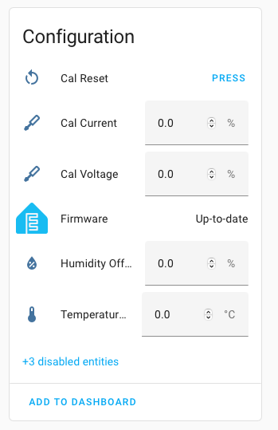

# Calibration

The Rowi2 supports **online calibration** for voltage, current, power, and energy sensors using the ESPHome web interface or Home Assistant.  
This allows you to fine-tune measurement accuracy without reflashing the device.

### How to Calibrate

1. **Navigate to the Device in Home Assistant**  
   Open the device page for your Rowi2 in Home Assistant.

2. **Locate the Calibration Entities**  
   Calibration is performed directly in the Home Assistant UI.  
   You will see calibration controls for:
   - Voltage Calibration
   - Current Calibration
   - Power Calibration (disabled by default)
   - Energy Calibration (disabled by default)

   
   

3. **Apply a Known Load**  
   For best results, connect a load with a known power draw (e.g., a 60W light bulb or a calibrated power meter).

> **Note:**  
> Changing the voltage or current calibration will also affect the power and energy readings, as these values are derived from the calibrated voltage and current measurements.
>
> **Recommended calibration order:**  
> 1. Voltage  
> 2. Current  
> 3. Power  
> 4. Energy  
> Calibrating in this order ensures the most accurate results, as power and energy are derived from the voltage and current measurements.

4. **Adjust Calibration Values**  
   - Adjust the calibration by changing the percentage value in the calibration field.  
     This will increase or decrease the current reading until it matches your reference measurement.  
     You do **not** enter a new measured value directly; instead, you fine-tune the displayed value using the percentage control.
   - The device will automatically update its internal calibration and adjust the sensor readings.
   - Repeat the process for each sensor as needed.

### Factory Reset Calibration

If you need to reset calibration values to their defaults:
- Use the **Cal Reset** button entity in Home Assistant, or
- Hold the device button for more than 10 seconds to trigger a full factory reset (this will also reset WiFi and all settings).

### More Information

**IMPORTANT**  
ESPHome documentation is currently in PR and awaiting merging improvements [PR#4744][esphome-docs-pr].

- See the [ESPHome BL0940 documentation][esphome-docs] for advanced calibration details.
- Calibration changes are stored in non-volatile memory and persist across reboots.

**Tip:**  
Accurate calibration ensures your energy monitoring is reliable and trustworthy.

[esphome-docs]: https://esphome.io/components/sensor/bl0940.html  
[esphome-docs-pr]: https://github.com/esphome/esphome-docs/pull/4744