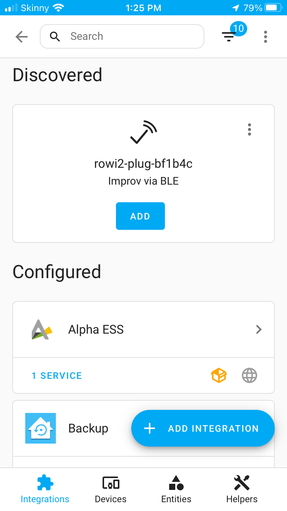
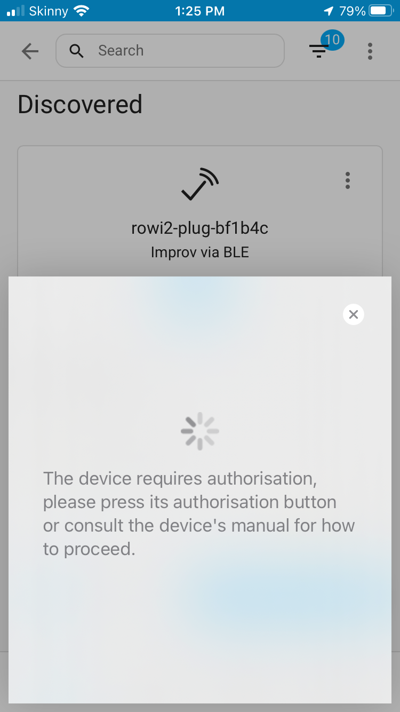
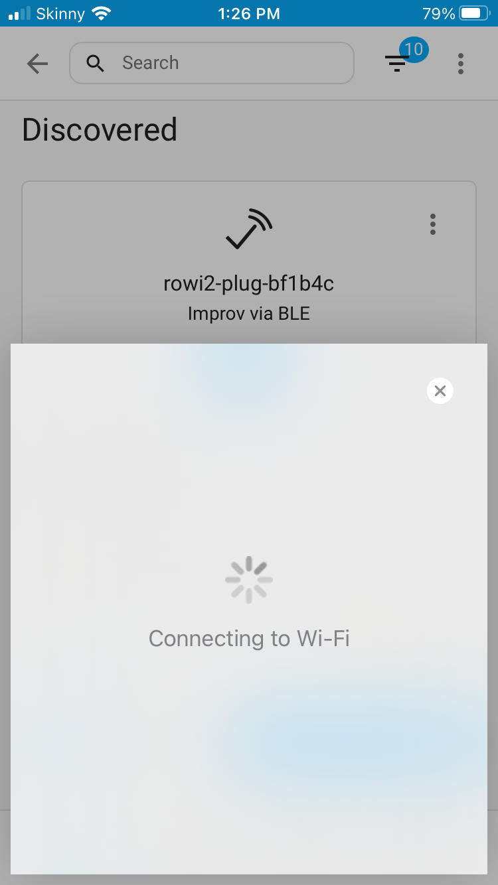
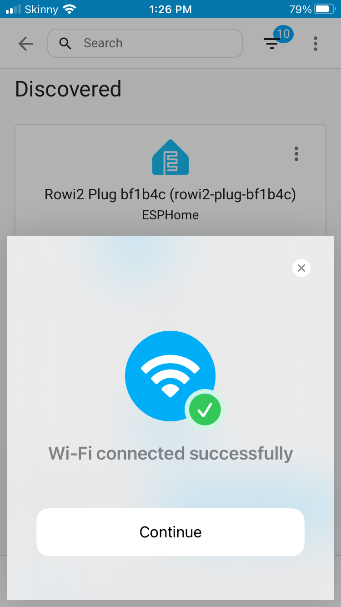
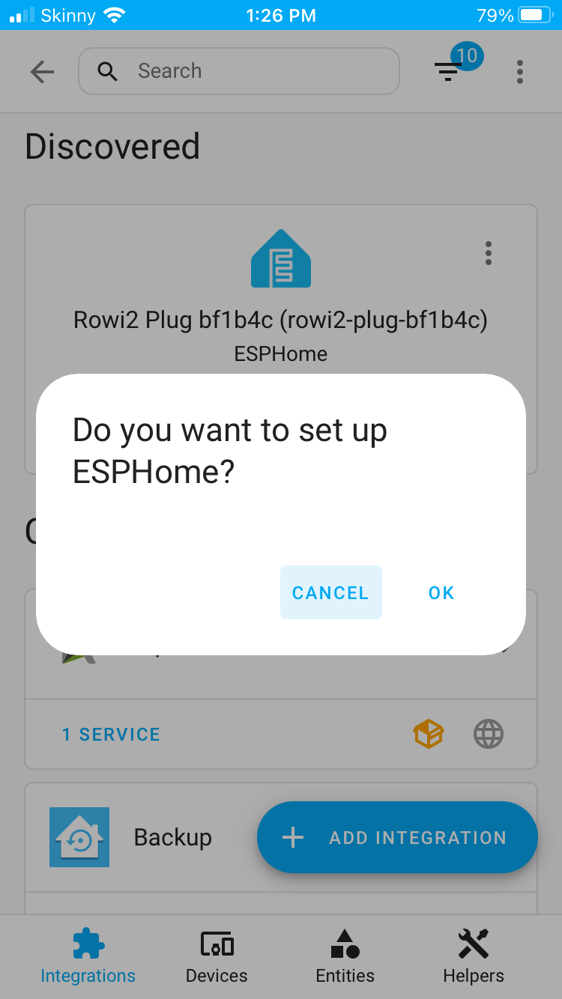
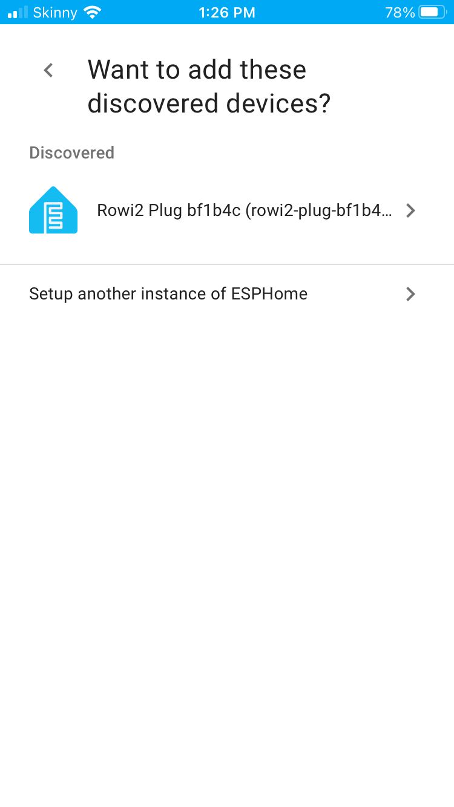
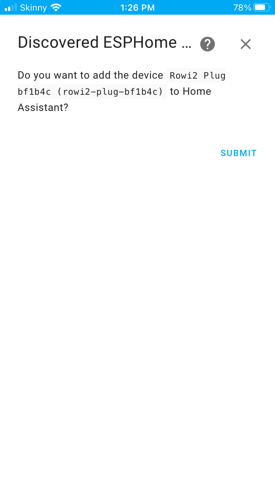
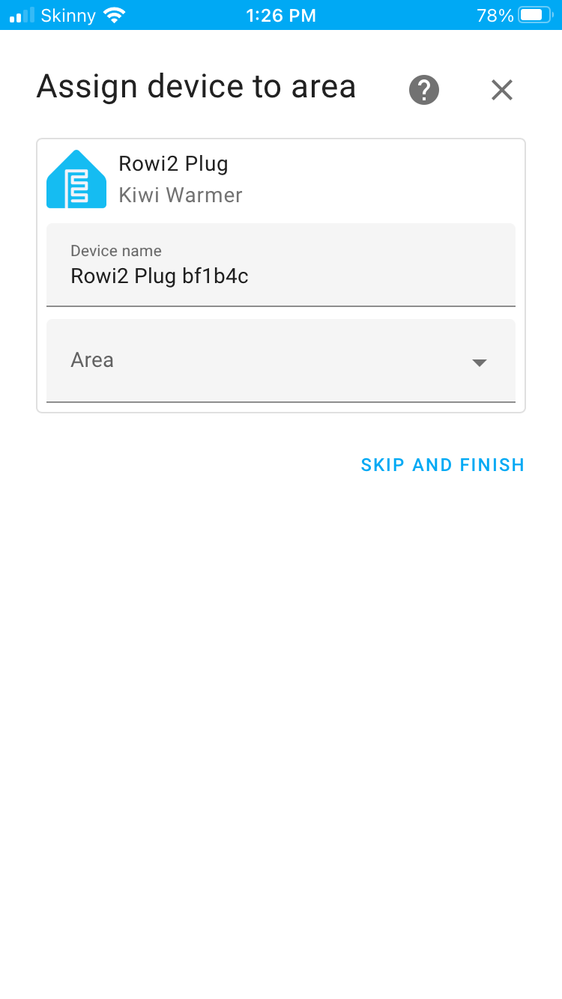
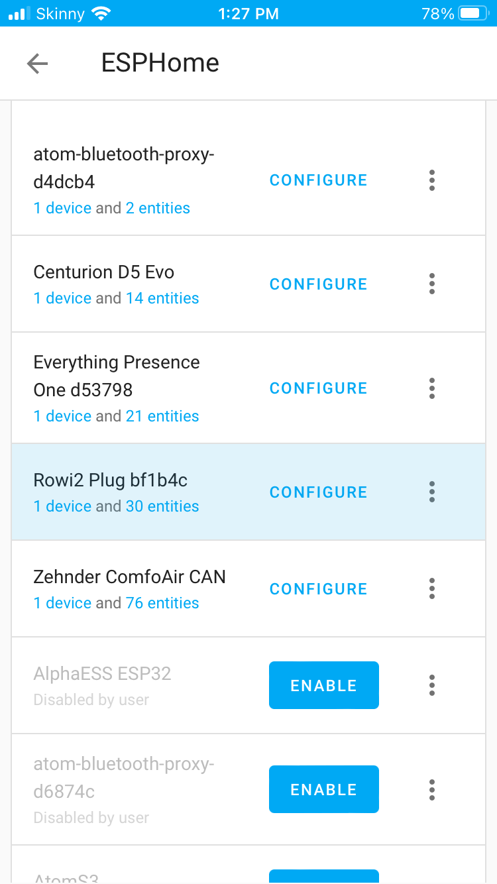

# Onboarding with Improv-BLE

After initial power-up or a factory reset, the device will enter onboarding mode for 10 minutes.

## How to Onboard

1. **Open the Home Assistant Companion App**  
   Make sure Bluetooth is enabled on your mobile device.

2. **Go to:**  
   **Settings → Devices & Services**

   
   
   
   
   
   
   
   

3. **View your onboarded device in ESPHome:**  
   Go to **Settings → Devices & Services → ESPHome** to see your device listed.

   

---

## Troubleshooting

- Ensure Bluetooth is enabled on your mobile device.
- Make sure the device is powered and in onboarding mode (after initial power-up or factory reset).
- If the device is not discovered, try restarting the device or the Home Assistant app.

